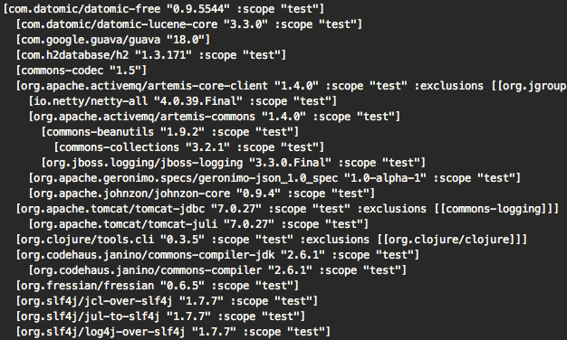
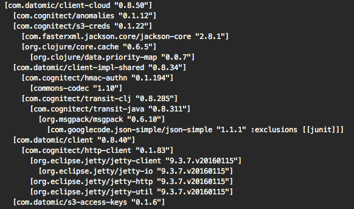
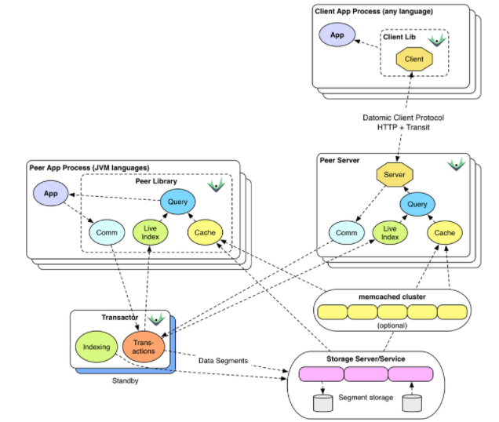
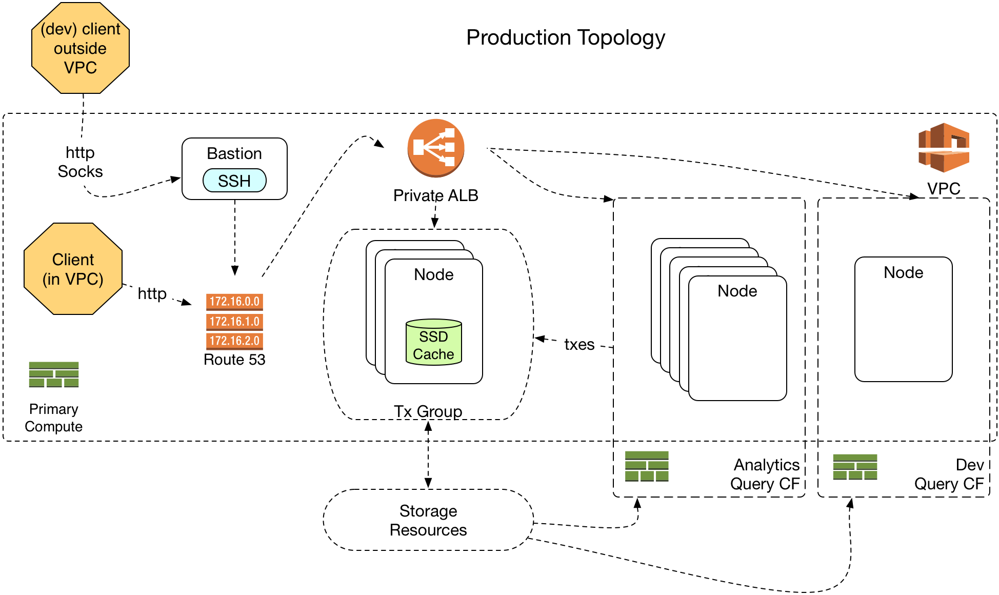

---

# Datalogを今日学ぼう!

- clj-nakano #4 2018/2/13
- 株式会社シグニファイア代表 中村研二 (github: k2n, twitter: @k2nakamura)

---

## 発表者について

- 93-00年 野村総合研究所、00-16年 米国スタートアップ数社で勤務
- 15年、200億円規模の米国証券バックオフィスシステムにClojureを適用
    - compojure-api, core.async, aleph, manifold, gloss, mysql, mongo db, docker, AWS
- 16年、Clojure+Docker+Micro Services+AWSでビスポーク開発を提供する株式会社シグニファイアを設立
- 16年、たばこ卸売業向けEコマースとたばこ税申告システム
    - AWS Lambda, Incanter, compojure-api, clara-rules, reagent, postgresql, docker, rancher, AWS
- 17年、グローバル法律事務所紹介ネットワークシステムでLegalWeek Innovation Awardsを受賞
    - reagent, re-frame, compojure-api, elastic search, postgresql, docker, rancher, AWS

---

## Value of Values

- メモリアドレスや、RDBMSレコードの内容を直接書き換える。⇒ Place Oriented Programming (PLOP)
- 不変的な値(Immutable data)を用いる。⇒ Value Oriented Programming
    - 他のシステムと共有でき、渡した値が一方で変更される心配がない |
    - 同じ値を渡せば同じ結果が得られる再現性がある。メモリアドレスを渡したら？結果は不定である。|
    - テストのための環境を再現するのが容易。値をセットすればいいだけで、オブジェクトなどの考慮不要。 |
    - 値は汎用的でどの言語にも対応する概念がある。 |
- 詳しくは[Value of Values](https://gitpitch.com/k2n/value-of-values-transcript-ja)のスライドで。|

---

## Datalogとは？

- 「演繹的データベースへの問い合わせ言語として用いられることの多い、Prologのサブセットである宣言的論理プログラミング言語」
    - Prologは、論理プログラミングに分類される言語。ファクトとルールで関係を記述する。その関係に対して宣言的問合せを実行することで計算を行う。
    - Prologには手続き型な要素を含むが、それを排除し、純粋に宣言的な記述に特化したのがDatalog。
    - 演繹的(deductive)データベースは、DBに格納されたファクトとルールを用いて演繹を行う。
- Clojureの開発者であるRich Hickeyが所属するCognitect社が提供する商用DB Datomicで、データ問合せの主な手段として利用されている。

---

## Datomicとは？

- ACID特性を持つ、分散型データベース
    - Atomic, Consistent (eventualではなくstrong), Isolate, and Durable 
- 書き込みは論理的に１つのプロセスが実行 |
    - Isolation levelはSerialized |
    - 実際は高可用性と複数DBの同時書き込みのため、複数プロセスが用いられる。|
    - IoTやビッグデータのログ格納のような、高いライトスループットを要求される案件には向かない。|
    - ACID特性が必要なビジネスデータに適している。|
- 書き込みは蓄積され、上書きや消去されることはない。(Value Oriented Programming) |
    - 更新は、同じキーに対し新しいレコードを蓄積することで実現。|
    - 削除はretractフラグで区別したレコードで実現。 |
- 結果として、データは古くなることはあっても変更されることはない。|
    - 汚染の心配なしにキャッシュ可能 |
    - データを複数のメディアに格納可能 (SSD, EFS, DDB, S3) |

---

## Datomic On-Prem （オンプレミス）Free


- 無料で利用可能（OSSではない）
- メモリ、またはローカルディスクにデータを格納する。 |
- Peerライブラリのみ利用可能 |
- 必要なプロセスが全て単一JVM内で動作 |

---

## Datomic On-Prem Pro Starter Edition

- 最初の１年間は無料で利用可能で、最新版にアップデート可能
- その後も既存のバージョンは引き続き利用可能だが、アップデートするには、年間５千ドルの契約が必要 |
- AWS DDB, RDBMS, Cassandraなどにデータ保存可能 |
- Peer, Client APIが利用可能 |
- Transactor, Peer Server(Client APIの場合）プロセスの起動が必要 |

---

## Datomic Cloud (AWS版）

- マネージド・サービスではなく、Cloud Formationでスタックを顧客のAWSアカウント内に立ち上げる方式
- 全てのプロセスとデータを自分のAWSアカウント内で管理できる |
- Client APIのみ利用可能 |

---

## Datomic Cloud Solo Topology

- AWSのコスト+ライセンスで月額約30ドル
- 全機能が利用可能だが、高可用性はない |
- EC2のインスタンスサイズは必要最小限 |

---

## Datomic Cloud Production Topology

- 高可用性, 単一障害点なし
- 自動スケールアウト、負荷分散 |
- 複数のクエリグループを利用可能 |

---

## Peer API

- PeerはDatalogクエリエンジンをライブラリとしてアプリケーションに組み込む形態
    - 高速で、複数DB、あるいはローカルのClojureデータをJoinした検索が可能 |
    - 依存関係を多数取り込む必要がある |
    - DDBなど、ストレージにアクセスするためのライブラリも別途必要 |
    - Transactor、ストレージへのセッションが必要となる |


---

## Client API

- Client APIは、Datomic Cloud、またはOn-Prem Proに付属するPeer-serverを経由してアクセス
    - ステートフルなDBへの接続や、データをキャッシュする必要が無い |
    - AWS LambdaなどのFaaSでも利用可能 |
    - 単一のDBに対してのみ検索可能 |
    - On-Prem Client APIではDBの作成・削除ができないなど、Peerに比べて機能が減らされている |
        - Peer ServerをDB毎に立てる必要があるので、Clientからの動的生成がそもそもできない  |
        - Cloud版はDBの作成、削除が可能 |



---



---



---

## Datomicのクエリ

- Datalog

```clojure
(require '[datomic.client.api :as d])

(def cfg {:server-type :cloud
          :region "<your AWS Region>" ;; e.g. us-east-1
          :system "<system-name>"
          :query-group "<system-name>"
          :endpoint "http://entry.<system-name>.<region>.datomic.net:8182/"
          :proxy-port <local-port for SSH tunnel to bastion>})
(def client (d/client cfg))
(def conn (d/connect client {:db-name "movies"}))
(def db (d/db conn))
;; query
(d/q {:query [:find ?release-name
              :where [_ :release/name ?release-name]]
      :args [db]})
;; result
;==> #{["Osmium"]
;      ["Hela roept de akela"]
;      ["Ali Baba"]
;      ["The Power of the True Love Knot"]
;  ...}
```

---

## Datomicのクエリ

- pull API

```clojure
(def db (d/db conn))

(d/pull db '[*] 809240558083034)
;==> {:db/id 809240558083034
;     :track/artistCredit "John Lennon"
;     :track/artists [{:db/id 527765581346058}]
;     :track/duration 217893
;     :track/name "I Found Out"
;     :track/position 3}
```

---

## Datomicのクエリ

- Index

```clojure
(def db (d/db conn))

(d/datoms db :eavt [:user/name "Mike"])
;==> #datom[50142128273096769 64 "Mike" 13194139533318 true]
```

---

## Datomicのクエリ

- Transaction

```clojure
(d/tx-range conn {:start 1001 :end 1001})
;==> [{:tx-data '([17592186045418 64 "Mike" 13194139534313 true]
;                 [17592186045419 64 "Dorrene" 13194139534313 true]
;                 [17592186045420 64 "Benti" 13194139534313 true]
;                 [17592186045421 64 "Derek" 13194139534313 true]
;                 [17592186045422 64 "Kristen" 13194139534313 true]) :t 1001}]
```

---

## Datalogを今日学ぼう！

- https://learn-datalog-today-ja.herokuapp.com/
